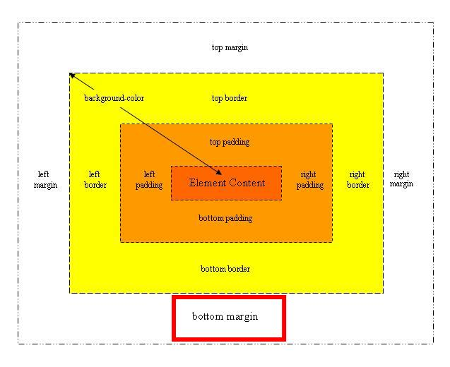
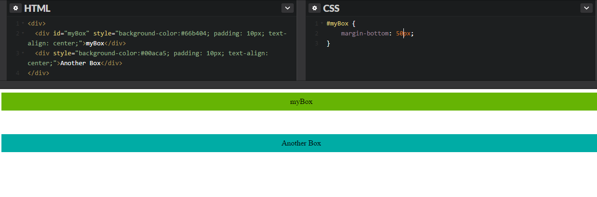
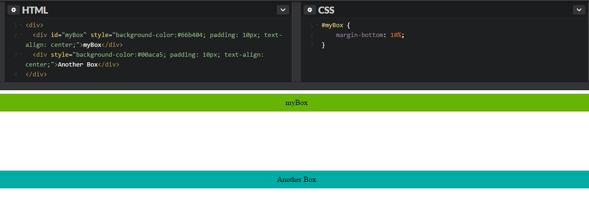
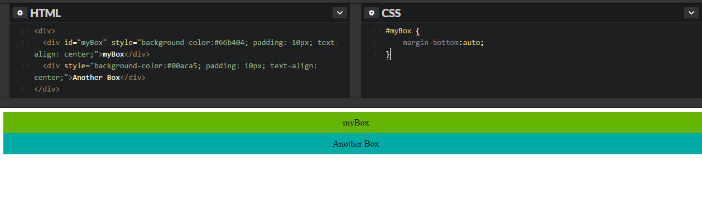
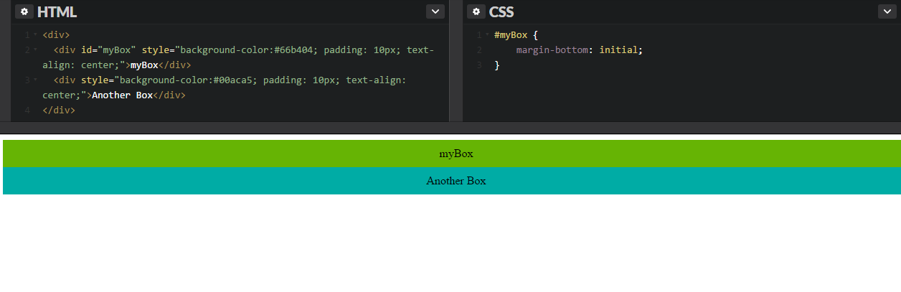
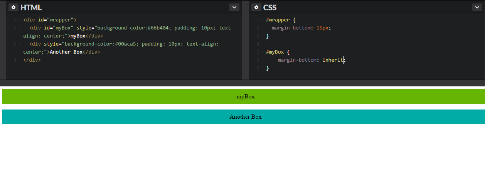
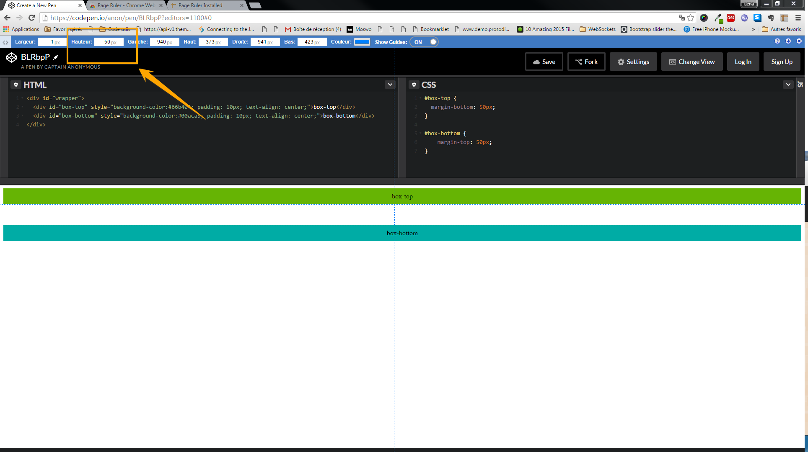

#`margin-bottom` in CSS

*The `margin-bottom` property in CSS sets the bottom margin for an HTML element.*

The CSS margin properties are used to generate space around elements. The margin-bottom property is used for setting the margin for the bottom side of an element.



## Syntax

Like all the margin properties, the margin-bottom property can take the following values : 

```
margin-bottom: length|percentage|auto|initial|inherit;
```


## Values

### → length

Specifies a fixed width in px, pt, cm, em, etc. 

Default value is 0.

Negative values are allowed.

#### Example : 

```
margin-bottom: 50px;
```


 
### → percentage

Specifies a width in % of the width of the containing element.

Negative Values are allowed.

#### Example : 

```
margin-bottom: 10%;
```




### → auto 

The browser calculates a bottom margin.

#### Example : 

```
margin-bottom: auto;
```




### → initial 

Sets this property to its default value.

#### Example : 

```
margin-bottom: initial;
```




### → inherit

Specifies that the margin should be inherited from the parent element.

#### Example : 

```
margin-bottom: inherit;
```




## Special Notes

**Margin collapse**

Collapsing margins happen when two elements with vertical margins are stacked on top of each other. If one margin is greater than the other, then that margin overrides the other, leaving only one margin.

This does not happen on horizontal margins (left and right), only on vertical margins (top and bottom).

On this example Here we can see that the space between the two elements amount to 50px instead of adding the bottom and top margins of the two stacked element : 



## Browser support

*The numbers in the table specify the first browser version that fully supports the property.*

| Chrome    | Internet Explorer        | Firefox   | Safari  | Opera   |
|---        |---                       |---        |---      |---      |
| 1.0       | 6.0                      | 1.0       | 1.0     | 3.5     |
